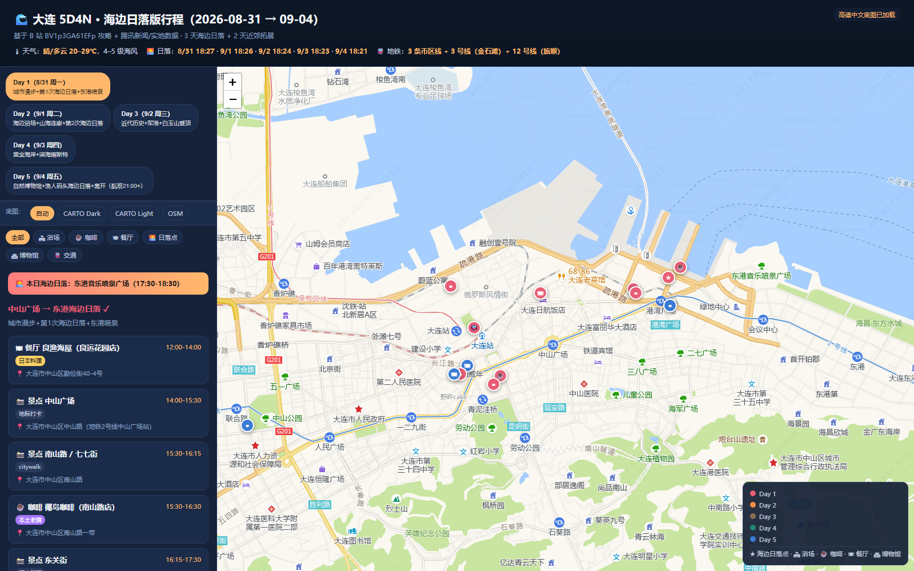
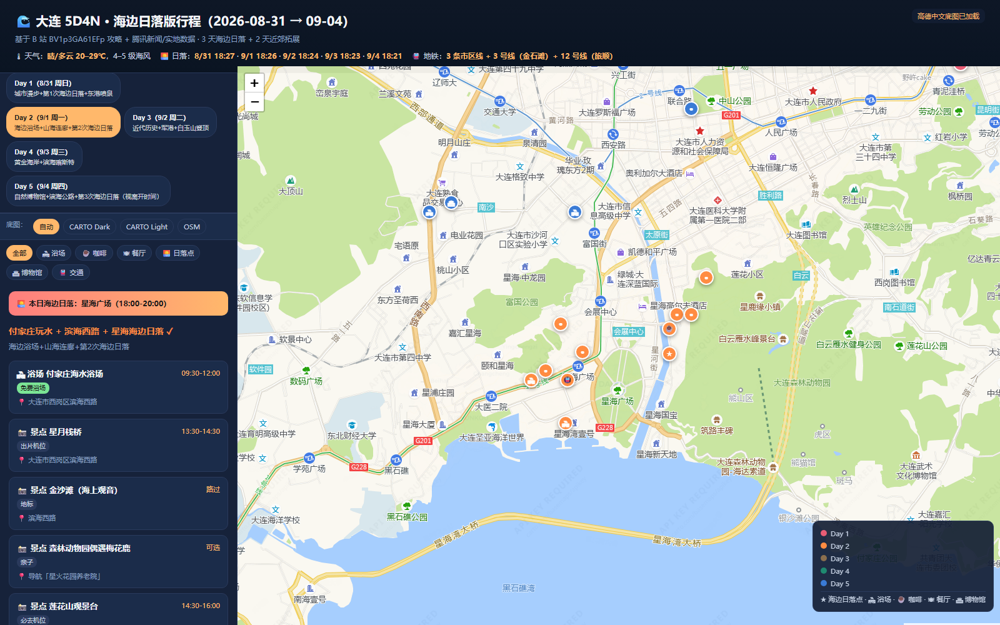
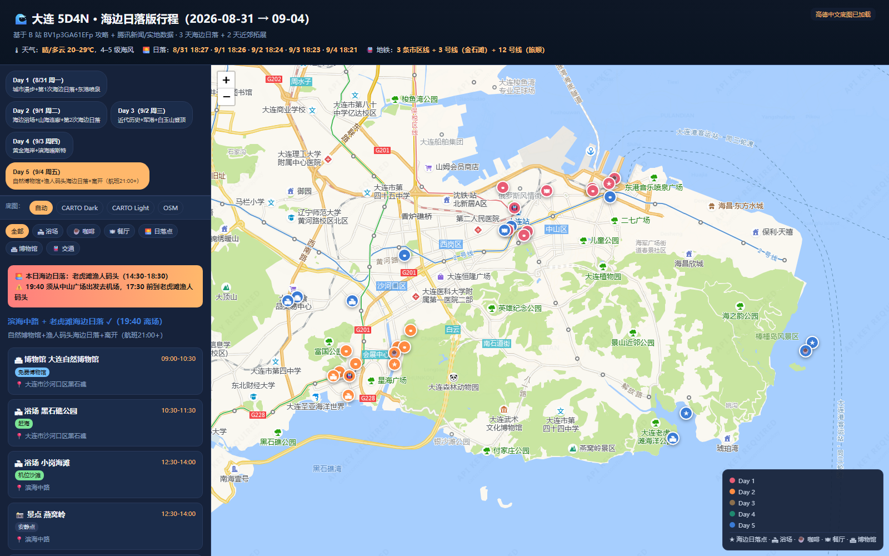
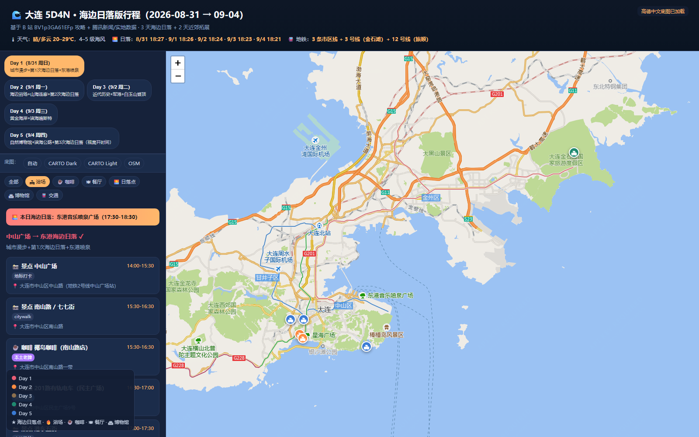

# 🌊 大连 5D4N 海边日落行程（2026-08-31 → 09-04）

> 3 天海边日落 + 2 天近郊拓展 · 参考 B 站视频 [《大连怎么玩效率最高？》](https://www.bilibili.com/video/BV1p3GA61EFp)

## 📂 文件说明

| 文件 | 说明 |
|------|------|
| `index.html` | **可交互行程地图**（双击打开 / 部署到任意静态网站） |
| `大连行程.md` | 完整 Markdown 行程，含每日时间表、推荐店名与理由 |
| `preview-*.png` | 各日行程预览（README 插图） |

## 🚀 部署到 GitHub Pages（3 分钟）

### 方案 A：直接上传

1. 在 GitHub 创建新仓库（如 `dalian-trip`），**设为 Public**
2. 把本目录所有文件（包括 `.nojekyll` 和 `.gitignore`）拖进仓库根目录
3. 仓库 → **Settings** → **Pages**
4. Source 选 **Deploy from a branch** → Branch 选 `main` / `(root)`
5. 等待 1–2 分钟，访问 `https://<用户名>.github.io/dalian-trip/` 即可

### 方案 B：用 git 命令行

```bash
cd github-pages-deploy
git init
git add .
git commit -m "大连行程首版"
git branch -M main
git remote add origin https://github.com/<用户名>/dalian-trip.git
git push -u origin main
# 然后到 GitHub 仓库 Settings → Pages 启用
```

## 🌐 本地预览

直接双击 `index.html` 即可在浏览器打开。

## ✨ 功能亮点

- **离线兜底**：内置预渲染地图背景（base64），完全断网也能看到大连地形
- **多源瓦片容错**：自动从 Carto / 高德 / OSM 加载，任意一个失败不影响其他
- **42 个 POI**：每条街道、浴场、咖啡店都有精确经纬度+地址+推荐理由
- **5 天日期 + 7 个过滤器**：可按浴场/咖啡/餐厅/日落/博物馆/交通筛选

## 🗺 地图操作

| 操作 | 说明 |
|------|------|
| 切换日期 | 顶部彩色 pill（Day 1 ~ Day 5） |
| 类别过滤 | 侧边栏"浴场 / 咖啡 / 餐厅..."chip |
| 底图切换 | "底图"chip（Carto Dark / Light / OSM） |
| 看 POI 详情 | 点击左侧列表项展开 |
| 飞行到位置 | 点击 POI 项后地图自动飞过去 |

## 📋 行程概览

| 日次 | 日期 | 星期 | 主题 | 海边日落 |
|------|------|------|------|----------|
| Day 1 | 8/31 | 周一 | 良渔海屋午餐 → 中山广场 → 东港 | ✓ 东港音乐喷泉广场 18:27 |
| Day 2 | 9/1 | 周二 | 付家庄玩水 + 滨海西路 + 星海 | ✓ 星海广场 18:26 |
| Day 3 | 9/2 | 周三 | 旅顺一日（军港/博物馆） | ✗ 改看军港日落 |
| Day 4 | 9/3 | 周四 | 金石滩全天（黄金海岸） | ✗ 海岸朝东，无西沉 |
| Day 5 | 9/4 | 周五 | 滨海中路 + 老虎滩日落 → 19:40 离场 | ✓ 老虎滩渔人码头 18:21 |

## 📸 预览

### Day 1（周一）


### Day 2（周二）


### Day 5（周五 · 含 19:40 离场警告）


### 浴场过滤器


## ⚠️ 注意事项

- 航班建议 ≥ 2 小时前到达机场（Day 5 周五晚上 21:00+ 起飞，需 19:40 从中山广场出发）
- 旅顺博物馆**周一闭馆**（现在 Day 3 是周三，正常开放）
- 大连自然博物馆**周一闭馆**（Day 5 周五，正常开放）
- 海边日落朝向：选朝**西南**的海岸（东港、星海、老虎滩渔人码头），朝东的（金石滩）只能看日出

## 📜 许可

个人旅行计划，仅供参考。所有店铺/景点信息基于 2026 年 8 月公开数据，请出发前再次核对营业时间和价格。
