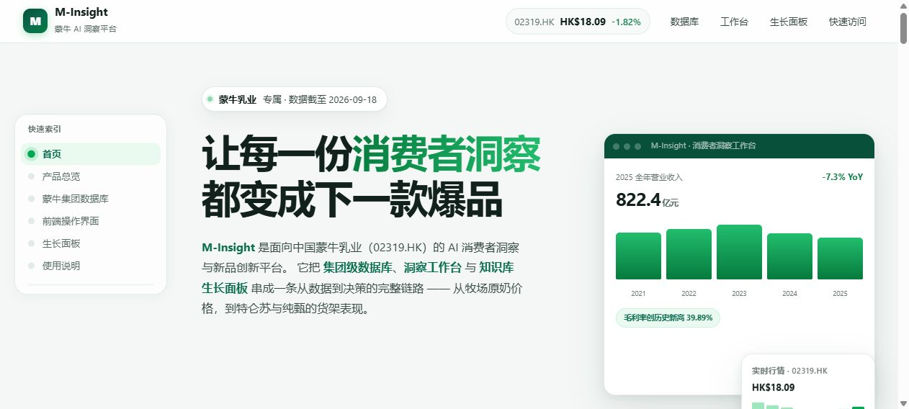
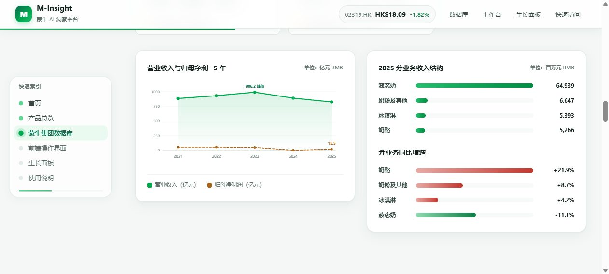

# scroll-driven-product-homepage

> 把一个本地项目打包成**一镜到底的滚动驱动可视化主页**（scroll-scrub 单页官网）的 Agent Skill。

面向这样的需求：

- 「把我目前的 X 产品打包成可视化可互动的个人主页 / 产品官网」
- 「往下滚动一镜到底，每滚动一次显示一个产品元素」
- 「侧边栏加个快速索引条，方便找内容」
- 「数据库不用逐条滚动显示，只要名称 + 大概内容 + 访问链接」

产出：**单文件 HTML + 本地截图资产**，可直接双击打开或部署到任意静态托管。

---

## 效果预览

| 首屏 Hero | 数据看板 |
|---|---|
|  |  |

页面结构：固定顶栏 + 固定左侧圆点索引条 + N 个连续章节。
滚动进度连续映射（`frame-scrub`）——**停下即停在当前画面**，不做硬切翻页。

---

## 它解决什么问题

把「做一个滚动官网」这件事，从**凭感觉调**变成**有据可依的流程**。核心是四件事：

### 1. 时间轴编译成唯一事实源

页面里的滚动区间不靠手写常量，而是由脚本从章节配置**编译**出来，并强制校验
oil-motion 的时间轴语义：

```
start <= hold < endExclusive
from → to 连链不断、无重叠、无空隙
state id 唯一，数量与页面 data-chapter 一一对应
末段 endExclusive 必须收敛到 1.0
```

校验不通过就**拒绝写出文件**，坏数据进不到页面里。

### 2. 索引条高亮与滚动严格同步

这里有个**很容易踩的坑**：如果拿章节区间内的某个比例位置当切换阈值，
索引高亮会稳定地**滞后一整章**——因为 `scrollIntoView` 对齐的是章节**顶部**。

正确做法是按章节真实滚动锚点（`offsetTop / maxScroll`）判定落在哪个区间，
并用 `ResizeObserver` 在布局变化后重算。

### 3. 对比度实算，不靠眼估

配色凭感觉写，实测经常不达标。本 skill 附带对比度计算器，逐色核验 WCAG 2.2 AA：

```bash
python scripts/contrast.py                      # 内置色板体检
python scripts/contrast.py "#12211b" "#ffffff"  # 自定义：前景色... + 末尾背景色
```

**最容易被忽略的是渐变按钮上的白字**：品牌色渐变的浅端往往只有 2.4:1 左右，
远低于 4.5:1。必须逐个停靠点算，再把整个渐变压深到深色区间。

### 4. 截图与验收的可复现步骤

内置本地预览服务和浏览器截图流程，并记录了若干会导致「截图变成纯白图」
「命令被 SIGTERM」的环境陷阱及规避方法。

---

## 仓库结构

```
.
├── SKILL.md                  # 完整工作流（7 个阶段）
├── scripts/
│   ├── compile_timeline.py   # 编译 timeline.json + 硬性语义校验
│   ├── contrast.py           # WCAG 2.2 对比度实算
│   └── serve.js              # 本地静态预览服务
└── assets/                   # 效果预览图
```

---

## 安装

### 方式一：克隆到 skills 目录

```bash
git clone <this-repo> ~/.workbuddy/skills/scroll-driven-product-homepage
```

Windows 对应路径为 `C:\Users\<你>\.workbuddy\skills\scroll-driven-product-homepage`。

### 方式二：只取需要的脚本

三个脚本都是**零依赖**的（Python 标准库 / Node 内置模块），可以直接拷走单独用。

---

## 快速上手

### 编译时间轴

```bash
# 用章节配置（推荐）
python scripts/compile_timeline.py --chapters chapters.json --out build/timeline.json

# 或命令行直接给
python scripts/compile_timeline.py \
  --section hero:首页:1.0 \
  --section overview:产品总览:0.85 \
  --section detail:详情:1.35 \
  --out build/timeline.json
```

`chapters.json`：

```json
[
  {"id": "hero",     "label": "首页",     "sub": "品牌露出", "weight": 1.0},
  {"id": "overview", "label": "产品总览", "sub": "三大模块", "weight": 0.85},
  {"id": "detail",   "label": "详情",     "sub": "数据看板", "weight": 1.35}
]
```

`weight` 控制该章节占整页的滚动比例——内容多的章节给大一点，停留更久。

### 检查对比度

```bash
python scripts/contrast.py "#12211b" "#c2372f" "#0e7d47" "#ffffff"
```

末位参数是背景色，前面的都是要检查的前景色。

### 起本地预览

```bash
node scripts/serve.js ./final 8899
# -> http://127.0.0.1:8899/
```

> 用 HTTP 而非 `file://`，因为部分场景下 `file://` 页面会被浏览器判为不可访问，
> 导致截图空白。

---

## 适用与不适用

| | |
|---|---|
| ✅ 适用 | 滚动叙事型产品主页/官网；把已有若干模块（目录、本地服务、面板）串成一页 |
| ❌ 不适用 | 纯静态介绍页（无滚动叙事）；需要生成视频素材的影片级动画 |

---

## 设计约定

**涨跌配色遵循中国市场惯例：红涨绿跌**，与欧美相反。金额默认 `¥` / 亿元，
港股用 `HK$`。每条数据应标注来源与更新日期；口径不同的数据（如不同咨询机构的
市占率）必须显式注明不可直接对比。

---

## 依赖

- Python 3.8+（仅 `scripts/compile_timeline.py`、`scripts/contrast.py`，全部标准库）
- Node.js 18+（仅 `scripts/serve.js`）
- 可选：`agent-browser`（用于自动截图真机界面）

---

## License

MIT
